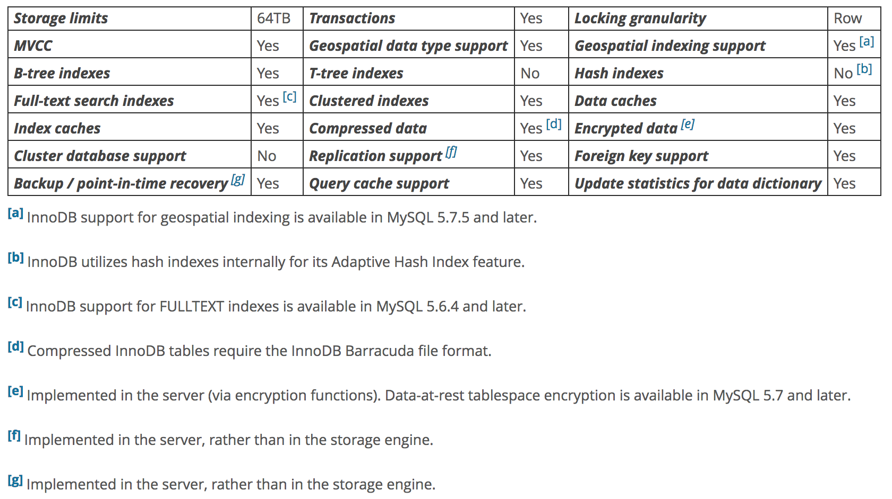

### InnoDB的优势
- DML 遵循ACID
- 行级锁，使用MVCC保证读一致
- 使用主键索引管理磁盘上的数据，加快查找速度
- 使用外键维持数据的完整性

### InnoDB表 最佳实践
- 主键的设定：把查询用的最多的column， 并且不怎么改动的设成主键；如果没有可以设置自增列为主键。
- 如果是基于一个列进行多表联查，使用join. 并且把join的列设置成外键，数据类型也要一致。这么做是因为外键会给列加索引，外键也会把删除和更新传到相关表。
- 关闭autocommit(可能是log flush的影响，待查)
- 把一系列的DML语句放在一个事务中。
- 不要使用`lock tables`语句。可以使用`select .. for update` 只针对某些row锁定更新。
- 开启**innodb_file_per_table**， 这样表的数据和索引是单独文件存在。
- 根据需求，可以使用`ROW_FORMAT=COMPRESSED`来压缩数据。

